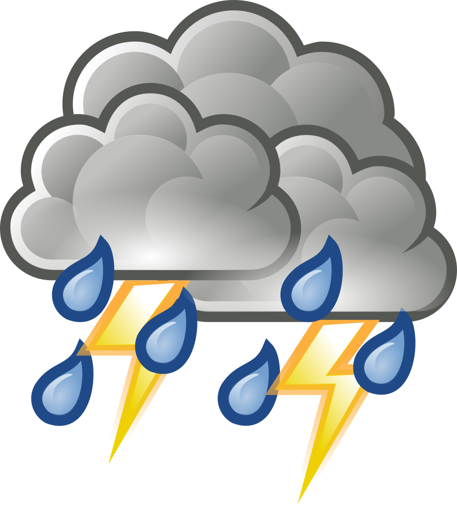
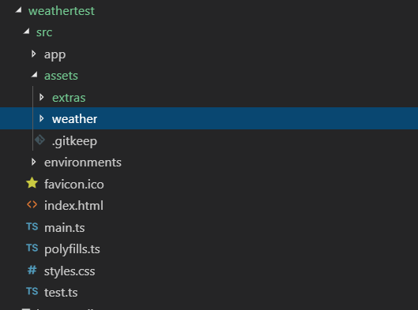

# @storm-pkg/weather

<p align="left">
    
</p>


Collection of Weater widgets and services to easily build weather application in one hour.

## Table of Contents
* [Installation](#installation)
* [Usage](#usage)


## Installation

First you need to install the npm module:

```sh
npm install @storm-pkg/weather
```

Choose the version corresponding to your Angular version:

 Angular     | @storm-pkg/weather
 ----------- | ------------------- 
 7           | 1.0.0             


## Usage

#### 1. Provide the `WeatherIntercepter`:

Finally, you can use @storm-pkg/weather in your Angular project. You have to import `WeatherIntercepter` in the root NgModule of your application as shown below.

```ts
import {BrowserModule} from '@angular/platform-browser';
import {NgModule} from '@angular/core';
import {HTTP_INTERCEPTORS, HttpClient } from '@angular/common/http';
import {WeatherInterceptor} from '@storm-pkg/weather';

@NgModule({
    imports: [
        BrowserModule
    ],
    providers: [
        {
            provide: HTTP_INTERCEPTORS,
            useClass: WeatherInterceptor,
            multi: true,
            deps: [HttpClient]
        }
    ]
    bootstrap: [AppComponent]
})
export class AppModule { }
```

This will handle all the Weather related apis centrally and add the Application Id to each apis.
It will also take care of error handling.

##### Add Assets to your application :

This library comes with some assets which are not included in the library and has to be included manually.
- Go to the ```projects/weathertest/assets``` and copy the ```weather``` folder which contains the assets.
- Paste the same folder inside your application ```src/assets``` folder as shown below.

<p align="left">
    
</p>

